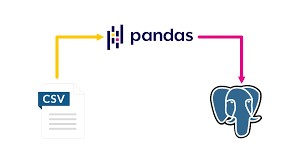

# Crowdfunding ETL Mini Project

## Project Description
This project involves building an ETL pipeline using Python, Pandas, and PostgreSQL to process data from a crowdfunding platform. The tasks include:

1. Extracting and transforming data from various sources.
2. Splitting the category and subcategory data.
3. Creating four CSV files and loading the transformed data into a PostgreSQL database.
4. Building an ERD and using it to define table schemas in SQL.

## Files in the Project

- **campaign.csv**: Contains details about each crowdfunding campaign, including company name, description, goal, and backers.
- **category.csv**: Contains a list of categories used for campaigns.
- **subcategory.csv**: Contains subcategories associated with campaigns.
- **contacts.xlsx**: Contains details about contacts associated with the campaigns.
- **crowdfunding_db_schema.sql**: SQL file that defines the schema for the PostgreSQL database.
- **queries.sql**: Contains SQL queries to verify the table creation and data insertion.

## Project Steps

### 1. Extract Data
We extracted data from CSV and Excel files, which contain information about the campaigns, categories, subcategories, and contacts.

### 2. Transform Data
We split the category and subcategory values in the campaign data, cleaned up the data types, and generated unique identifiers for the categories and subcategories. For instance, the `category` and `subcategory` columns were split and cleaned.

### 3. Create CSV Files
We created four CSV files: campaign.csv, category.csv, subcategory.csv, and contacts.csv, and used them for database loading.

### 4. Load Data into PostgreSQL

We defined a schema for the PostgreSQL database using the `crowdfunding_db_schema.sql` file and loaded the transformed data.
To load data into PostgreSQL, the following steps were followed:

- Created a new PostgreSQL database `crowdfunding_db`.
- Ran the schema file to create the required tables with the appropriate foreign keys.
- Imported each CSV file into its corresponding table.

### 5. Verify Data Loading
To verify that the data was correctly inserted, we ran a SELECT query on each table.

## ERD (Entity Relationship Diagram)
The ERD shows the relationship between the four tables (campaign, category, subcategory, and contacts) in the PostgreSQL database.

## How to Run the Project
1. Ensure Python is installed and the required libraries (Pandas, SQLAlchemy) are available.
2. Set up PostgreSQL, create a new database named `crowdfunding_db`, and run the `crowdfunding_db_schema.sql` file to create the tables.
3. Use the provided CSV files to load the data into the PostgreSQL tables.
4. Verify the data by running the queries in `queries.sql`.

## Conclusion
This project demonstrates the full ETL process from data extraction, transformation, to loading into a relational database. The schema design, data processing, and SQL integration are critical for handling real-world data pipelines.

### Teamwork

This project is a collaborative effort between *Anupreet Kaur* and *Zara Pazouki*.